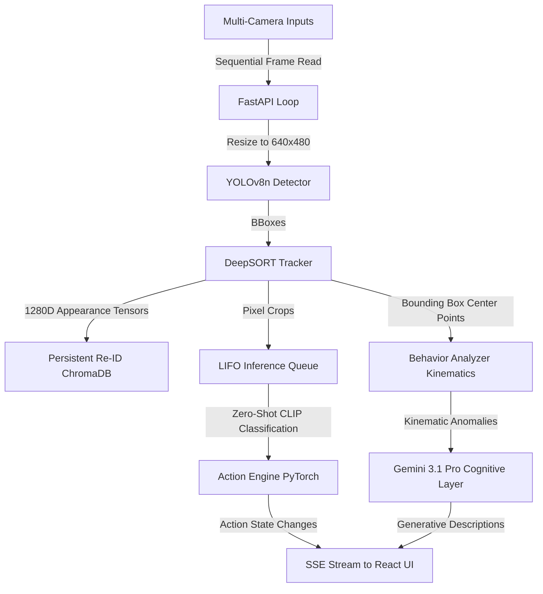

# Chronos: Architecture Limitations & Technical Constraints

This document provides a highly detailed, rigorous analysis of the architectural, mathematical, and computational limitations of the **Chronos Cognitive Surveillance Terminal** codebase. It has been prepared to serve as both an engineering roadmap for future development and a robust "Defense Annex" for academic/college project evaluations.

---

## 🗺️ High-Level Summary Architecture



---

## 1. System & Processing Architecture (Concurrency Bottlenecks)

### ⚠️ Sequential Camera Processing (Parallelism Bottleneck)
* **Code Reference:** `api/main_api.py` (Lines 85-112)
* **The Constraint:** Although the server is built on FastAPI's async loops, the video frames from multiple sources are processed **sequentially inside a single block**:
  ```python
  for i, cap in enumerate(caps):
      ret, frame = await asyncio.to_thread(cap.read)
  ...
  for i, frame in enumerate(frames):
      detections = await asyncio.to_thread(detector.detect, frame)
      active_tracks = await asyncio.to_thread(trackers[i].update, detections, frame)
  ```
* **Limitation:** Awaiting `to_thread` calls in a sequential `for` loop does not execute them in parallel. If a single camera feed takes `15ms` for YOLO detection, `5ms` for tracking, and `5ms` for Re-ID, a 4-camera grid will take `4 * 25ms = 100ms` per tick, capping the absolute maximum framerate of the stream at **10 FPS**, regardless of GPU availability.
* **Mitigation:** Refactor the loop to utilize `asyncio.gather` to execute the YOLO detection and DeepSORT tracking pipelines for all active cameras concurrently.

### ⚠️ Shared YOLO Instance Contention
* **The Constraint:** There is only a single, shared `PersonDetector` object holding the YOLOv8n network model.
* **Limitation:** PyTorch model inferences are single-threaded by nature on a single device context. Sequential calls to `detector.detect(frame)` from different cameras force CPU/GPU context-switching, leading to execution queues on the hardware level.
* **Mitigation:** Deploy independent detector instances per camera feed, or implement a frame-batching aggregator that feeds a single composite batch tensor (Shape: `[NumCameras, 3, 480, 640]`) to YOLOv8 in a single forward pass.

### ⚠️ Concurrent SQLite/ChromaDB File Locks
* **Code Reference:** `core/reid.py` and `core/cognitive.py`
* **The Constraint:** Both the Re-ID system and the Cognitive Event logging layers instantiate separate persistent clients:
  ```python
  self.client = chromadb.PersistentClient(path=db_path)
  ```
* **Limitation:** ChromaDB's default local storage uses SQLite under the hood. Multiple processes or async task workers reading and writing to the database file concurrently can lead to operational database locks (`database is locked`), causing silent failures or unhandled server exceptions.
* **Mitigation:** Implement a unified Database Singleton or abstract access via an asynchronous client-server database broker (e.g. running a standalone ChromaDB docker container or server process accessed via `HttpClient`).

---

## 2. Object Detection & Computer Vision (YOLOv8n)

### ⚠️ Model Precision vs. Speed Tradeoff
* **Code Reference:** `core/detection.py` (Line 4)
* **The Constraint:** The system is configured to use the smallest standard model: `yolov8n.pt` (Nano).
* **Limitation:** While YOLOv8n delivers extremely fast inference speeds, it suffers from poor spatial resolution accuracy. It has a high rate of false negatives in scenarios with overlapping crowds (occlusions), small subject bounding boxes (subjects far from the camera), and poor low-light environment calibration.

### ⚠️ Static Bounding Box Confidence Cutoff
* **Code Reference:** `core/detection.py` (Line 8)
* **The Constraint:** The confidence limit is hardcoded to `0.45`:
  ```python
  results = self.model(frame, classes=[0], conf=0.45, verbose=False)
  ```
* **Limitation:** While filtering out noise and false detections, a static threshold of `0.45` makes the system completely blind to humans that are partially occluded (e.g., behind desks, counters, or structural columns) or those captured in unfavorable lighting conditions.

### ⚠️ Low-Resolution Downscaling
* **Code Reference:** `api/main_api.py` (Line 89)
* **The Constraint:** All high-definition input streams are hard-downscaled to a fixed resolution:
  ```python
  frame = cv2.resize(frame, (640, 480))
  ```
* **Limitation:** In practical security environments, standard HD camera streams contain vital high-frequency details. Downscaling to `640x480` destroys these details, preventing the detection of remote subjects and feeding highly degraded bounding box crops to the PyTorch Action and Re-ID engines.

---

## 3. Persistent Re-Identification (Re-ID)

### ⚠️ High Sensitivity to Light, Shadow, and Posture
* **Code Reference:** `core/reid.py` (Line 4)
* **The Constraint:** The system uses DeepSORT's 1280-dimension appearance vector matched against a rigid cosine distance threshold of `0.15`:
  ```python
  self.collection = self.client.get_or_create_collection(
      name="person_reid",
      metadata={"hnsw:space": "cosine"}
  )
  self.threshold = threshold  # Default: 0.15
  ```
* **Limitation:** Appearance vectors rely heavily on the visual color distribution of a person's clothing. If a subject walks under a warm incandescent light, moves into a shadow, or changes their physical profile (e.g. putting on a jacket or turning sideways), the Cosine distance to their original stored vector will easily exceed the strict `0.15` threshold. The system will then erroneously register a new identity (e.g. `Subject-2` instead of `Subject-1`).
* **Mitigation:** Incorporate a dynamic Re-ID voting system that aggregates multiple vectors over time, or fine-tune a dedicated Re-ID metric model (like OSNet) rather than relying solely on the default tracking features.

### ⚠️ Uncapped Memory Growth & Latency Degradation
* **The Constraint:** Every unmatched vector is permanently added to ChromaDB:
  ```python
  self.collection.add(
      embeddings=[vector],
      ids=[new_subject_id],
      metadatas=[{"system": "reid"}]
  )
  ```
* **Limitation:** There is no archival, vector decay, or index pruning mechanism. In a production environment running 24/7, the vector database will collect tens of thousands of vectors. Because ChromaDB performs exhaustive similarity searches, query latency will degrade exponentially over time, slowing down the main tracking loop.
* **Mitigation:** Implement a rolling vector consolidation algorithm, or restrict vectors in the active matching database to a moving temporal window (e.g., 24 hours).

### ⚠️ Thread-Unsafe Subject Registration (Race Conditions)
* **Code Reference:** `core/reid.py` (Lines 44-56)
* **The Constraint:** Setting a new subject ID uses a standard database count query:
  ```python
  count = self.collection.count()
  new_subject_id = f"Subject-{count + 1}"
  ```
* **Limitation:** When multiple camera feeds process frames concurrently, two separate worker threads can execute `self.collection.count()` simultaneously before a database write is committed. This results in a race condition where two different people are registered under the exact same `Subject-X` ID.
* **Mitigation:** Use a database transaction lock or an atomic thread-safe sequence generator to allocate unique sequential IDs.

---

## 4. Action Recognition Engine (PyTorch & CLIP)

### ⚠️ Lack of Temporal Context (Static Bounding Box Classification)
* **Code Reference:** `core/action.py`
* **The Constraint:** Chronos uses OpenAI's CLIP zero-shot image classification model (`openai/clip-vit-base-patch32`), which operates purely on **individual, static 2D image crops**:
  ```python
  pil_img = Image.fromarray(cv2.cvtColor(image_crop, cv2.COLOR_BGR2RGB))
  result = self.classifier(pil_img, candidate_labels=self.labels)
  ```
* **Limitation:** Physical actions are temporal sequences (motion over time). CLIP has zero temporal memory; it analyzes a single static snapshot. Consequently, the model cannot distinguish between static standing, slow walking, or rapid running, nor can it reliably identify dynamic actions (like stealing vs. reaching) from a single frozen frame.
* **Mitigation:** Replace CLIP with a true video-based action recognition model (e.g., VideoMAE, SlowFast, or a temporal LSTM network over consecutive YOLO bounding box crops).

### ⚠️ Silent Frame Dropping & Inference Starvation
* **Code Reference:** `core/action.py` (Lines 9-100)
* **The Constraint:** The background PyTorch classifier worker consumes image crops via a LIFO queue capped at a size of `30`. If the queue is full, new crops are dropped:
  ```python
  # Fast reject if queue full (stops video lagging)
  if self.q.full():
      return
  ```
* **Limitation:** On standard hardware, CLIP inference takes between `30ms` to `150ms` per crop. In active environments with 4 cameras and 8 total subjects, the backend generates up to **48 crops per second** (assuming a check every 15 frames). The inference worker cannot keep up, resulting in the queue filling up instantly. The system silently drops the majority of crops, leaving active subjects stuck in the `"ANALYZING..."` or `"UNKNOWN"` state indefinitely in the UI.

### ⚠️ Short-Term Track ID Dependency
* **Code Reference:** `core/action.py` (Line 75)
* **The Constraint:** Behavioral history and action gates are indexed strictly by DeepSORT's localized `track_id`, not the global `subject_id`:
  ```python
  # Temporal Logic Override: Cannot be shoplifting unless previously loitering or reaching
  if mapped_label == "SHOPLIFTING":
      history = self.action_history.get(track_id, set())
      if "LOITERING" not in history and "REACHING" not in history:
          mapped_label = "LOITERING"
  ```
* **Limitation:** Because the state is bound to `track_id`, if a subject is temporarily occluded or walks out and in of frame (causing DeepSORT to assign a new `track_id` even if Re-ID successfully resolves them as the same `Subject-1`), their entire action history is permanently wiped. This prevents the execution of complex multi-stage behavioral rules (e.g., Shoplifting detection can never trigger if a track ID shifts).

---

## 5. Behavior Analyzer & Kinematics

### ⚠️ Bounding Box Pixel Coordinates vs. Real-World Space
* **Code Reference:** `core/behavior.py` (Lines 15-36)
* **The Constraint:** Spatial velocity is calculated using raw 2D pixel coordinates:
  ```python
  cx = (ltrb[0] + ltrb[2]) / 2
  cy = (ltrb[1] + ltrb[3]) / 2
  ...
  distance = math.hypot(cx - px, cy - py)
  speed = distance / dt
  ```
* **Limitation:** Pixel-based kinematics ignore perspective, resolution, and distance from the camera lens (depth parallax). A person strolling slowly directly in front of the lens will cover hundreds of pixels, triggering a false `"Running"` anomaly. Conversely, a person sprinting at full speed in the background will cover very few pixels, failing to trigger the velocity anomaly entirely.
* **Mitigation:** Implement camera calibration matrices (Homography) to map 2D pixel coordinates to 3D real-world floor planes, allowing physical speeds to be calculated in meters per second.

### ⚠️ Over-Simplistic Loitering Logic
* **Code Reference:** `core/behavior.py` (Line 38)
* **The Constraint:** A loitering anomaly is triggered solely on the duration of a track's existence:
  ```python
  if duration > self.duration_threshold or speed > self.speed_threshold:
  ```
* **Limitation:** The analyzer checks only if a track has remained on screen for more than `10.0` seconds. It does not measure spatial clustering or bounding-box variance. A person walking naturally along a long corridor who stays in the camera's wide field of view for 11 seconds will trigger a false loitering alert, despite moving continuously.

---

## 6. Cognitive Layer & LLM Dependencies

### ⚠️ Sync API Calls Wrapped in Thread pools
* **Code Reference:** `core/cognitive.py` (Line 34)
* **The Constraint:** The connection to Google Gemini 3.1 Pro is processed synchronously inside `asyncio.to_thread`:
  ```python
  response = await asyncio.to_thread(
      self.model.generate_content,
      [prompt, frame_image]
  )
  ```
* **Limitation:** While wrapping in `to_thread` prevents freezing the primary event loop, it spawns a synchronous execution thread. If the network connection drops, or if Gemini's API experiences high latency, multiple blocked threads will accumulate in FastAPI's pool, exhausting system resource limits.

### ⚠️ Silent Failures on Network or Quota Errors
* **Code Reference:** `core/cognitive.py` (Lines 44-46)
* **The Constraint:** Exceptions thrown during API generation are caught silently and return empty strings:
  ```python
  except Exception:
      return ""
  ```
* **Limitation:** If the Google API key is invalid, the rate limit is exceeded, or the network goes offline, the cognitive layer fails silently. The server continues running, but anomalies are never described or logged in ChromaDB, with zero indication of failure provided to the UI operator.

### ⚠️ Unstable Hash Keys for Database Events
* **Code Reference:** `core/cognitive.py` (Line 51)
* **The Constraint:** Unique event logging keys are generated utilizing Python's native `hash()` function:
  ```python
  event_id = f"log_{timestamp}_{hash(text)}"
  ```
* **Limitation:** Python 3 employs **hash randomization** across execution sessions. This means `hash("...")` is non-deterministic and will return different values every time the FastAPI process restarts. Consequently, the database is susceptible to primary key collisions and orphaned, unreachable event indexes when the server reboots.
* **Mitigation:** Replace `hash()` with a standard cryptographic hashing algorithm (like `hashlib.sha256()`) or structured GUID generation (`uuid.uuid4()`).

### ⚠️ Timestamp Collision in Event IDs
* **Code Reference:** `core/cognitive.py` (Line 25)
* **The Constraint:** The key for cognitive anomalies is determined by a raw timestamp string:
  ```python
  event_id = str(timestamp)
  ```
* **Limitation:** Because the system clock may have matching millisecond stamps across simultaneous camera feeds, two anomalies occurring at the exact same moment on different cameras will produce identical `event_id` keys, resulting in database collisions and one of the events being dropped.

---

## 📊 Summary Comparison: Chronos Limitations vs. Production Standards

| Component | Chronos Current Implementation | Production-Grade Surveillance Standard | Severity |
| :--- | :--- | :--- | :--- |
| **Camera Sync** | Sequential CPU-bound frame analysis loops. | Async, parallelized GPU batching pipelines. | **High** |
| **Object Detection** | YOLOv8n (Nano), fixed confidence and class. | Dynamic models (YOLOv8x/RT-DETR) with active scale tuning. | **Medium** |
| **Action Recognition** | Static 2D frame CLIP classification (No Memory). | Spatio-temporal video models (SlowFast/VideoMAE). | **Critical** |
| **Re-Identification** | Raw 1280-dimension color features in local SQLite ChromaDB. | Structured Re-ID networks (OSNet) with database consolidation. | **High** |
| **Kinematics** | Bounding box pixels/second (Perspective blind). | Homography mapped 3D real-world meters/second. | **High** |
| **System State** | Transient In-Memory arrays. | Distributed persistent state cache (e.g. Redis + PostgreSQL). | **Medium** |
